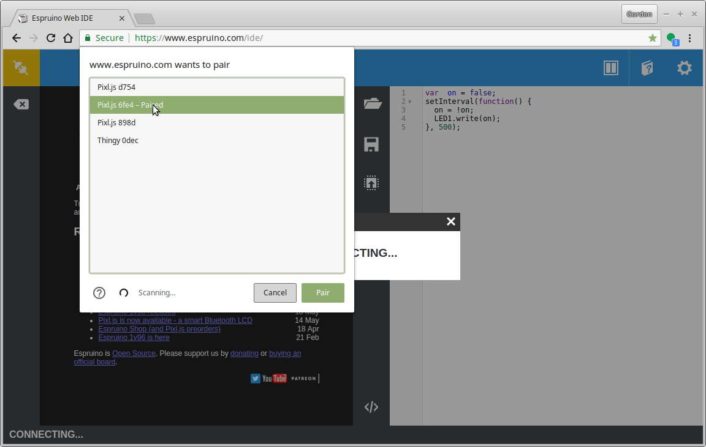
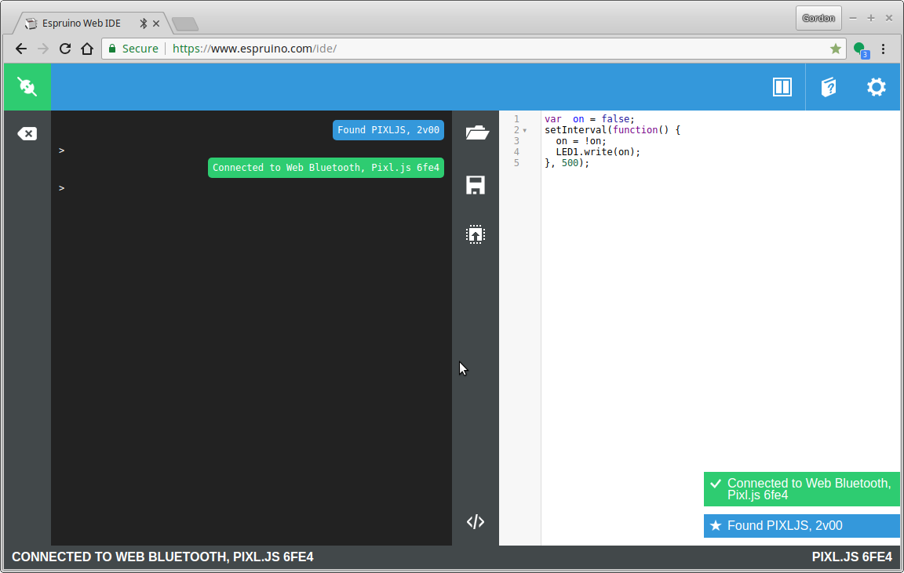

# Bluetooth Workshop

In this workshop we'll figure out how to use Web Bluetooth to interact with
other devices - but also how to use Espruino on embedded devices to develop
our own Bluetooth-enabled hardware.

## Step 1 - Connecting

The first step is to make sure you can connect to your Badge via Web Bluetooth.
We'll do this with the Espruino IDE - once connected you'll be able to fully reprogram your badge if you want to.

* First, go to http://www.espruino.com/ide **in an up to date Chrome Web Browser**
* Click the connection icon in the top left

* You should see `Web Bluetooth` - if you don't, check out [Espruino's Guide](http://www.espruino.com/Quick+Start+BLE#with-web-bluetooth) and if there's nothing useful there, seek help. We have a few USB dongles that'll work on older Macs and PCs.

* Now it's time to set up the badge so you can connect to it. Press a button
on the left-hand side to bring up the menu.
* Choose `Make Connectable`

* Now you should see the following screen - note the Name shown on-screen.

* Click the connect icon in the top left of the IDE again, and click `Web Bluetooth`
* You should see a bunch of devices - choose the one with the name as it is written on your badge's screen:

* Now you should be connected!

* On the left-hand side of the IDE is a REPL where you can enter commands. There's
Tab Completion which may help you.
* On the right-hand side there's an editor. Ctrl-Space will autocomplete, including documentation on the various functions available.
To upload code from the right-hand side, just click the 'Upload' button right in the middle of the IDE.

While waiting for everyone else, there are a few things you can do...

* Try the simple on-screen tutorial by clicking the book in the top right of the IDE,
followed by `Tutorial`
* See the written Espruino intro at http://www.espruino.com/Quick+Start+Code
* Check out your Nodeconf Badge's documentation and examples **FIXME: Link needed**
* Play around with the [Graphics library](http://www.espruino.com/Reference#Graphics) - the badge comes with a built-in Graphics class called `g`. You just need to call `g.flip()` to update your changes to the LCD display.
* Try some of [Espruino's Pixl.js Tutorials/Code](http://www.espruino.com/Pixl.js#tutorials),
for example the [Morphing Clock](http://www.espruino.com/Morphing+Clock)


## Web Bluetooth Steps...

If the IDE at http://www.espruino.com/ide worked for you then great,
you're sorted!

If it didn't and it couldn't be made to work, but you can get Node.js and [Noble](https://github.com/noble/noble) working then
you can use [the Web Bluetooth wrapper for Node](https://www.npmjs.com/package/webbluetooth)
to follow along with more or less the same code (you can also use the
[Espruino command-line tools]((https://www.npmjs.com/package/espruino)) to communicate with your badge.

================================================================================

## Step 2 - Advertising

The most basic part of Bluetooth LE is advertising. So a device can be 'found'
and connected to (eg. appear in the 'Web Bluetooth' dialog), it broadcasts
a short message (31 bytes!) about itself. It does this a few times a second - there's no kind
of delivery response, so the packets can get lost - but eventually some will
get through.

It's a nice, easy, unauthenticated one-to-many way of transmitting data. Apart
from security, the only downside is that the receiver needs to keep listening
on the radio for packets, which uses a lot of energy.

**I've set up a device that broadcasts its name as `ENV`, along with the current Temperature and Humidity.**

### UUIDs

We only have 31 bytes - that's not a lot - in fact the whole of Bluetooth LE
is a bit constrained. As a result, the folks defining the spec decided to
do something to save space:

Pretty much everything in Bluetooth LE is described by a UUID. Common things,
or things that people are willing to pay a lot of money to the Bluetooth SIG
for are described by nice, compact 16 bit UUIDs. There are also 32 bit UUIDs that
nobody uses much, and finally there are 128 bit UUIDs - which are completely free.
Create a randomish number (`date|md5sum`), and you're good to go.

However 128 bit UUIDs are 16 bytes. This isn't a big deal for an actual connection,
but in advertising you rarely want to use up over half of your 31 byte budget -
so for this example we're staying with some predefined 16 bit UUIDs. See the
note right at the end about Manufacturer data.

So - how do we see this data? Unfortunately while there is an addition to the
spec in development, Web Bluetooth doesn't yet let you read data from devices
advertising it.

### Use your phone

(Optional...) Go to your Phone's app store and search for `NRF Connect` by
`Nordic Semiconductor`. This is an app created to help you debug Bluetooth LE devices.

* Start it, make sure `Scanner` is selected, and hit `Scan` up the top right.
* You should see a whole bunch of devices that are owned by people in the room
* You should see a device called `ENV` (you can also filter by name if too
  many devices appear).
* Tap on the device, and you should see information about it reported - including
the Temperature (which the app can decode) and Humidity as `0x2A6F` (which it can't).

### Use your Badge!

Since you're hopefully still connected to your badge, you can ask it to scan
for devices. There are a few ways to do this....

* [`NRF.setScan(callback(device), options)`](http://www.espruino.com/Reference#l_NRF_setScan) will
call a function for every received advertising packet.
* [`NRF.findDevices(callback(devices), options)`](http://www.espruino.com/Reference#l_NRF_findDevices) will
listen for a set interval (2 secs default) and will call the function with all the devices found.
* [`NRF.requestDevice(filter) => promise(device)`](http://www.espruino.com/Reference#l_NRF_requestDevices) is
Espruino's version of the [Web Bluetooth `navigator.bluetooth.requestDevice`](https://developer.mozilla.org/en-US/docs/Web/API/Bluetooth/requestDevice)
which we'll come to later. It finds one device matching the filters, and completes the promise with it.

Given we're in a room with a million Bluetooth LE devices, to make things easy
we won't use the first two functions. We'll use `requestDevice`, which is fast
and efficient.

Copy the following code and paste it on to the left-hand side of the IDE.

```
NRF.requestDevice({filters:[{name:"ENV"}]}).then(device => {
  console.log("Found device");
  console.log(device);
}).catch(err => {
  console.log("There was a problem!", err);
});
```

You may see this (after a few seconds delay):

```
>NRF.requestDevice(...
=Promise: {  }
There was a problem! No device found matching filters
```

Which means that during the 2 second period of searching for devices, nothing
was found. Just use up-arrow to recall the previous command and enter to execute
and try again.

Everything going well, you should see something like this:

```
>NRF.requestDevice(...
=Promise: {  }
Found device
BluetoothDevice: {
  "id": "c0:03:88:c9:0d:ec random",
  "rssi": -29,
  "data": new Uint8Array([2, 1, 5, 5, 22, 110, 42, 157, 9, 5, 22, 111, 42, 86, 17, 4, 9, 69, 78, 86]).buffer,
  "name": "ENV",
  "serviceData": {
    "2a6e": new Uint8Array([157, 9]).buffer,
    "2a6f": new Uint8Array([86, 17]).buffer
   }
 }
```

* `id` is the MAC address of the device (there are different types of MAC address, `random` (locally unique) and `public` (unique in the world) - but we don't cover that here)
* `rssi` is the signal strength
* `data` is the raw advertising data that was received.
* `name` and `serviceData` are decoded data from the raw advertising packet.

`serviceData` contains the [16 bit Characteristic UUIDs](https://www.bluetooth.com/specifications/gatt/characteristics)
defined by the Bluetooth SIG, along with the data from them.

So, how do we get at our data? It's already been partially decoded for us into
an ArrayBuffer. All we need to do is use either a `DataView` or `Uint16Array` to
decode it into a 16 bit value again, and divide by 100:

```
NRF.requestDevice({filters:[{name:"ENV"}]}).then(device => {
  // Sanity checks
  if (!device.serviceData ||
      !device.serviceData["2a6e"] ||
      !device.serviceData["2a6f"]) {
    console.log("Corrupt advertising data");
    console.log(device);
    return;
  }
  // decode into an object
  var hum = {
    temperature : (new Uint16Array(device.serviceData["2a6e"]))[0]/100,
    humidity : (new Uint16Array(device.serviceData["2a6f"]))[0]/100
  };
  // display what we got
  console.log("Found device");
  console.log(hum);
}).catch(err => {
  console.log("There was a problem!", err);
});
```

Copy and paste into the left-hand side of the IDE and it'll produce:

```
> ...
=Promise: {  }
Found device
{ "temperature": 24.87, "humidity": 43.94 }
```

Finally, we can wrap it all up in a function, write the data to the LCD,
and then call it every 10 seconds using `setInterval`, and we have our
own weather station!

You can copy/paste this code to the left-hand side too, or you can
use the right-hand side and upload.

```
function scan() {
  NRF.requestDevice({filters:[{name:"ENV"}]}).then(device => {
    // Sanity checks
    if (!device.serviceData ||
        !device.serviceData["2a6e"] ||
        !device.serviceData["2a6f"]) {
      console.log("Corrupt advertising data");
      console.log(device);
      return;
    }
    // decode into an object
    var hum = {
      temperature : (new Uint16Array(device.serviceData["2a6e"]))[0]/100,
      humidity : (new Uint16Array(device.serviceData["2a6f"]))[0]/100
    };
    // display what we got
    g.clear();
    g.setFontVector(20);
    g.drawString(hum.temperature, 20,8);
    g.drawString(hum.humidity, 20,40);
    g.setFontBitmap();
    g.drawString("Temperature ('C)", 0,0);
    g.drawString("Humidity (%)", 0,32);
    g.flip();
  }).catch(err => {
    // There was a problem - we don't care as we expect it sometimes...
  });
}

setInterval(scan, 10000);
scan();
```


Want to use Node.js to read the data? [There's some info about it here](http://www.espruino.com/Puck.js+Advertising)

### Do how do you broadcast?

Most devices don't have a Humidity sensor, so I used a [Nordic Thingy:52](http://www.espruino.com/Thingy52)
running Espruino - however the same applies to any device.

All you need to do is call [`NRF.setAdvertising(...)`](http://www.espruino.com/Reference#l_NRF_setAdvertising)
with the services and data you wish to advertise (note that everything must
be a byte array. If you supply a string, it'll be converted to a byte array
for you).

The code used is just as follows:

```
// Get humidity/temp readings from the Thingy
Thingy.onHumidity(function(hum) {
  // Bluetooth spec says data is 16 bits, 0.01/unit - so x100
  var t = Math.round(hum.temperature*100);
  var h = Math.round(hum.humidity*100);
  // Set advertising data and name
  NRF.setAdvertising({
    0x2A6E : [t&255,t>>8],
    0x2A6F : [h&255,h>>8],
  },{
    name:"ENV",       // change the name
    connectable:false // don't allow anyone to connect
  });  
});

function onInit() {
  NRF.setTxPower(4); // Highest transmit power
}
```

You can do exactly this kind of thing on your Badge as well, but note that
Advertising only works when then badge **isn't connected to your PC**, which
makes it slightly more frustrating for a workshop!

### A note on Advertising data

Looking at the data we'd received, we have:

```
[2, 1, 5, 5, 22, 110, 42, 157, 9, 5, 22, 111, 42, 86, 17, 4, 9, 69, 78, 86]
```

The data is decoded as a series of:

* Byte Length (excluding the length)
* Type of data [from this list](https://www.bluetooth.com/specifications/assigned-numbers/generic-access-profile)
* Actual data

So the data above decodes as:

```
[2, 1, 5,  // 2 bytes, Bluetooth LE flags
5, 22, 110, 42, 157, 9,  // 5 bytes, Service Data, 0x2A6E + 2 bytes temperature
5, 22, 111, 42, 86, 17,  // 5 bytes, Service Data, 0x2A6F + 2 bytes humidity
4, 9, 69, 78, 86 ] // 4 bytes, Name, E..N..V
```

You're only supposed to use the Bluetooth SIG provided 16 bit UUIDs for service
data (and we have abused that somewhat by sending temperature and humidity
characteristic UUIDs). You can however make your own 128 bit UUIDs as described above, but
we have only 31 bytes of advertising data in total!

Obviously in that case Service Data is not ideal - so you can specify 'Manufacturer Data', which
uses a 16 bit UUID which you can get for free, but by registering with the Bluetooth
SIG. Espruino has it's own - `0x0590`. See [`NRF.setAdvertising(...)`](http://www.espruino.com/Reference#l_NRF_setAdvertising)
for an example of using it.

The only reason we're not using it for this workshop is that we're currently using
`0x0590` on your badges to report 'Clapometer' for the conference, so we'd
prefer it wasn't used in the workshop!

================================================================================


## Step 3 : Services, and Web Bluetooth

So, we've seen a simple way to receive data from a Bluetooth device, but how
do you transmit (or 'push') data to one? With Bluetooth LE, you need to have
created a connection to a device to do that.

Bluetooth LE has some confusing terminology here:

* Peripheral/Server - This is the device that 'serves' up the characteristics,
like a smartwatch or a lightbulb.
* Central/Client - This is the device that initiates the connection to a Peripheral
or Server and sends it commands.


### Services and Characteristics

When you connect to a Bluetooth device, it advertises a bunch of 'Services' it
provides. These are described by a UUID (either 16, 32 or 128 bit).

For instance a wireless lightbulb may provide a 'light' service and a 'battery' service.

Each Service has Characteristics (also described as a UUID), which are basically like variables that can be:

* Read
* Written
* Set up for Notifications - this will tell the connecting device when the value has changes (Indications are almost the same sort of thing)

So for our wireless lightbulb example we might have:

* **Service:** Light
  * **Characteristic:** Brightness (writable, readable)
  * **Characteristic:** Hue (writable, readable)
* **Service:** Battery
  * **Characteristic:** Percent Charge (readable, notify)

You can have more than one of the same type of service or Characteristic, so
for example our wireless lightbulb may have two lights, or two batteries.

These can be a nightmare to figure out when trying to connect to a device with
code, so it really helps to use an app like `nRF Connect` (mentioned above)
to really dig into them...

### Nordic UART Service

The Bluetooth SIG defines [a bunch of standard 16 bit UUIDs](https://www.bluetooth.com/specifications/gatt/services)
that can be used, however one thing it doesn't define is a simple way to send
character data.

This is probably intentional, to stop people using it for everything instead
of defining services.

However that hasn't stopped Nordic Semi (who make the chips we're using) from
defining their own standard, called 'Nordic UART', using the 128 bit UUIDs.

This consist of one Service, and two characteristics:

* **Service:** UUID 6e400001-b5a3-f393-e0a9-e50e24dcca9e - Nordic UART
  * **Characteristic:** UUID 6e400002-b5a3-f393-e0a9-e50e24dcca9e - TX (notify)
  * **Characteristic:** UUID 6e400003-b5a3-f393-e0a9-e50e24dcca9e - RX (writable)

**A note on UUIDs:** While 128 bit UUIDs are 16 bytes, once a connection is established
the UUID is remembered - as long as you create one 'base' UUID of the form
`0000xxxx-0000-0000-0000-000000000000` and then change only the `xxxx` bit
it's pretty efficient - which is what Nordic have done above.

Espruino devices use a Nordic UART Service for their REPL - so
for instance this is what you see looking at an Espruino in the `nRF Connect` app:


And with the service 'expanded':


### Creating an HTTPS page

First, as a test that everything is working, we're going to use a simple library for Espruino called
[puck.js](http://www.espruino.com/Puck.js+Web+Bluetooth), which makes it easy to send text over the
Nordic UART Service. Then, we'll move onto bare Web Bluetooth.

Since the REPL is available over the Nordic UART, all we'll do is send JS
commands followed by a newline. For instance `'LED1.set();\n'` should turn
the LED on.

For security reasons, Web Bluetooth will only work from a webpage served over HTTPS (not from HTTP,
or a local file) and not from within an `iframe`, so we can't just use something
like [jsfiddle](https://jsfiddle.net/)

You may have your own arrangement (HTTPS on localhost) in which case use
whatever works for you, but here are the steps to use GitHub:

* Log in or create an account on [GitHub.com](https://github.com)
* Click on the `Repositories` tab, and click `New`
* Enter `PuckTest` as the name, make sure you check `Initialize this repository with a README`,
and click `Create` (if you don't, you'll have to use command-line tools to create a new file)
* Click on the `Settings` tab in the top right
* Scroll down to `GitHub Pages`, under `Source` choose `master branch` and click `Save`
* Now go back to the `Code` tab, and click `Create new file` in the top right
* Enter `test.html` as the name
* Now Copy and paste the following code and click `Commit new file` at the bottom:

```HTML
<html>
 <head>
 </head>
 <body>
  <script src="https://www.puck-js.com/puck.js"></script>
  <button onclick="Puck.write('LED1.set();\n');">On!</button>
  <button onclick="Puck.write('LED1.reset();\n');">Off!</button>
 </body>
</html>
```

You'll now have your own webpage at: https://your_username.github.io/PuckTest/test.html

Now...

* Make sure you have disconnected from your device using the Web IDE, but
leave your device connectable as detailed right at the start.
* Go to your Webpage URL, and click the `On` button
* If all goes well, you'll get  the Web Bluetooth window where you can select
you device
* Not working? Try [the version hosted on the Espruino site](https://www.espruino.com/try.php?page=Puck.js+Web+Bluetooth&n=0)
and see if that works.
* After a few seconds the red LED should light
* You can then click `Off` and `On` to toggle it
* Close the webpage to disconnect

More info about this [is on the Espruino site](http://www.espruino.com/Puck.js+Web+Bluetooth).


================================================================================


## Step 4 : Web Bluetooth - Writing

Ok, so we know what we're doing is working. Let's do some proper Web Bluetooth,
without the libraries.

First, let's set the badge up with some demo code that's pre-loaded on it,
which creates a service which allows you to control the RGB LED and Vibration
motor.

* Ensure you don't have the `nRF Connect` app or and Web Bluetooth pages open and connected to the badge
* Flip the switch on the back to power cycle your badge.
* Press a button on the left-hand side to get to the menu

* Choose `Blueooth Workshop`

* Choose `LED/Buzzer Control`

* You should now see a menu saying the badge is connectable.

So what just happened? The Badge has now configured itself as the following:

* **Service:** UUID 7b340000-105b-2b38-3a74-2932f884e90e - Badge Service
  * **Characteristic:** UUID 7b340001-105b-2b38-3a74-2932f884e90e - LEDs - 3 bytes (writable)
  * **Characteristic:** UUID 7b340002-105b-2b38-3a74-2932f884e90e - Vibraton motors - 2 bytes (writable)

If we write to one of the characteristics, things should happen!

So how do we do that?

* Change your HTML file on GitHub to the following:

```HTML
<html>
<body>
<button onclick="connect()">Connect to Web Bluetooth</button>
<script>
function connect() {
  var options =  {
    filters: [
      {namePrefix: 'Pixl.js'},
    ],
    optionalServices: [ "7b340000-105b-2b38-3a74-2932f884e90e" ]
  };  
  var busy = false;
  var gatt, service;
  // Bring up the Web Bluetooth Device Chooser
  navigator.bluetooth.requestDevice(options).then(function(device) {
    console.log('Device: ' + JSON.stringify(device));
    return device.gatt.connect();
  }).then(function(g) {
   gatt = g;
   // Get our custom service
   return gatt.getPrimaryService("7b340000-105b-2b38-3a74-2932f884e90e");
  }).then(function(service) {
    // Get the RGB LED characteristic
    return service.getCharacteristic("7b340001-105b-2b38-3a74-2932f884e90e");
  }).then(function(characteristic) {    
    // Make a random color
    var rgb = new Uint8Array([
	    Math.random()*255,
	    Math.random()*255,
	    Math.random()*255]);
    // Write it to the characteristic
    return characteristic.writeValue(rgb);
  }).then(function() {    
    gatt.disconnect();
    console.log("All Done!");
  }).catch(function(error) {
    console.log("Something went wrong. " + error);
  });
}
</script>
</body>
</html>
```

* Reload it, and click the `Connect to Web Bluetooth` button
* Select your badge from the Web Bluetooth Screen
* And all being well, your screen should change colour! Each time you click
the button, it'll reconnect and change to a new colour.

So what just happened? A few things:

* `navigator.bluetooth.requestDevice` was used to pop up a window and grab your device
* `device.gatt.connect()` then initiated a connection
* `gatt.getPrimaryService("7b340000-105b-2b38-3a74-2932f884e90e")` found the service matching the UUID we gave it
* `service.getCharacteristic("7b340001-105b-2b38-3a74-2932f884e90e")` found the matching characteristic (for the LEDs this time) on the given service (there can be other matching characteristics on another service)
* We used `characteristic.writeValue(rgb)` to write a`Uint8Array` of data to the badge
* After all that, `gatt.disconnect()` disconnects

And `Promises` glued it all together so we didn't end up with lots of nested callbacks.

You could try modifying this to:

* Flash the LEDs different colors using repeated `characteristic.writeValue`
* Change the Vibration motors using a different service UUID and a two element array (each element is a 0..255 value for motor speed).

### More Features

You can add colour selectors and sliders for setting the motor speed if you
want to. Take a look at this example!

You do need to ensure that you don't try and perform two
Bluetooth LE operations on the same connection at once.

To simplify this I've used a `busy` flag, but ideally you'd
have a queue of some kind.

```HTML
<html>
<body>
<button onclick="connect()">Connect to Web Bluetooth</button>
<input type="color" id="color" value="#e66465" style="display:none"/>
<input type="range" id="vibrateleft" min="0" max="255" value="0" style="display:none"/>
<input type="range" id="vibrateright" min="0" max="255" value="0" style="display:none"/>
<script>
function connect() {
  var options =  {
    filters: [
      {namePrefix: 'Pixl.js'},
    ],
    optionalServices: [ "7b340000-105b-2b38-3a74-2932f884e90e" ]
  };  
  var busy = false;
  var gatt, service;
  navigator.bluetooth.requestDevice(options).then(function(device) {
    console.log('Device: ' + JSON.stringify(device));
    return device.gatt.connect();
  }).then(function(g) {
   gatt = g;
   // Get our custom service
   return gatt.getPrimaryService("7b340000-105b-2b38-3a74-2932f884e90e");
  }).then(function(s) {
    service = s;
    // Get the RGB LED characteristic
    return service.getCharacteristic("7b340001-105b-2b38-3a74-2932f884e90e");
  }).then(function(characteristic) {    
    var colorPicker = document.querySelector("#color");
    colorPicker.style.display = "block";
    colorPicker.addEventListener("input", function(event) {
      var col = event.target.value;  // #bbggrr
      var rgb = new Uint8Array([
      	parseInt(col.substr(5,2),16),
       	parseInt(col.substr(3,2),16),
      	parseInt(col.substr(1,2),16)]);
      if (busy) return;
      busy = true;
      characteristic.writeValue(rgb).then(function() {
        busy = false;
      });
    }, false);    
    // Get the Vibration characteristic
    return service.getCharacteristic("7b340002-105b-2b38-3a74-2932f884e90e");
   }).then(function(characteristic) {    
    var vibl = document.querySelector("#vibrateleft");
    var vibr = document.querySelector("#vibrateright");
    vibl.style.display = "block";
    vibr.style.display = "block";
    function vibChange(event) {
      console.log(vibl.value,vibr.value);
      if (busy) return;
      busy = true;
      var v = new Uint8Array([vibl.value,vibr.value]);
      characteristic.writeValue(v).then(function() {
        busy = false;
      });
    }
    vibl.addEventListener("input", vibChange, false);
    vibr.addEventListener("input", vibChange, false);        
  }).then(function() {
    //gatt.disconnect();
    console.log("Done!");
  }).catch(function(error) {
    console.log("Something went wrong. " + error);
  });
}
</script>
</body>
</html>
```


### How do you do this on the Bluetooth Peripheral?

The code needed to handle this on the peripheral (which is being called when
you choose the menu item) is simply:

```JS
NRF.setServices({
 "7b340000-105b-2b38-3a74-2932f884e90e" : {
   "7b340001-105b-2b38-3a74-2932f884e90e" : {
     writable : true,
     value : [0,0,0],
     maxLen : 3,
     onWrite : function(evt) {
       var d = new Uint8Array(evt.data);
       var c = [0|d[0],0|d[1],0|d[2]];
       NC.backlight(c.concat(c,c,c));
       NC.ledTop(c);
       NC.ledBottom(c);
       Terminal.println("LED "+d);
     },
   },
   "7b340002-105b-2b38-3a74-2932f884e90e" : {
     writable : true,
     value : [0,0],
     maxLen : 2,
     onWrite : function(evt) {
       var d = new Uint8Array(evt.data);
       analogWrite(VIBL,(0|d[0])/255);
       analogWrite(VIBR,(0|d[1])/255);
       Terminal.println("BUZZ "+d);
     }
   }
 }
},{uart:false});
```

================================================================================


## Step 5 : Web Bluetooth. Notifications

Ok, so what if we want to get data from a Bluetooth Peripheral?

Well, we could use `characteristic.readValue()` which behaves exactly like
you'd expect - it returns a promise which resolves with the value.

However in many cases we're not interested repeatedly making readings,
but in getting notified when a reading changes.

* Ensure everything (including the Web Bluetooth page) is disconnected from Espruino
* Close the tab with the Web Bluetooth Page (the Badge's services can end up being cached)

* Choose `Accelerometer` from the Badge's menu

* You should now see a menu saying the badge is connectable.

The Badge has now configured itself as the following:

* **Service:** UUID 7b340000-105b-2b38-3a74-2932f884e90e - Badge Service
  * **Characteristic:** UUID 7b340003-105b-2b38-3a74-2932f884e90e - Accelerometer - 3 bytes (notifyable)

So all we have to do is use `getPrimaryService` and `getCharacteristic` to find
the characteristic as before, but then `characteristic.startNotifications()` to
start us receiving `characteristicvaluechanged` events whenever the badge
sends a notification.

```HTML
<html>
<body>
<button onclick="connect()">Connect to Web Bluetooth</button>
<div id="data"></div>
<script>
function connect() {
  var options =  {
    filters: [
      {namePrefix: 'Pixl.js'},
    ],
    optionalServices: [ "7b340000-105b-2b38-3a74-2932f884e90e" ]
  };  
  var busy = false;
  var gatt, service;
  navigator.bluetooth.requestDevice(options).then(function(device) {
    console.log('Device: ' + JSON.stringify(device));
    return device.gatt.connect();
  }).then(function(g) {
   gatt = g;
   // Get our custom service
   return gatt.getPrimaryService("7b340000-105b-2b38-3a74-2932f884e90e");
  }).then(function(s) {
    service = s;
    // Get the Acceleorometer characteristic
    return service.getCharacteristic("7b340003-105b-2b38-3a74-2932f884e90e");
  }).then(function(characteristic) {    
    var dataDiv = document.querySelector("#data");
    // When we get a notification, write the data to a div below the button
    characteristic.addEventListener('characteristicvaluechanged', function(event) {
      var value = event.target.value.buffer; // an arraybuffer
      dataDiv.textContent = (new Int8Array(value)).toString();
    });
    // Now start getting notifications
    return characteristic.startNotifications();
  }).then(function() {
    //gatt.disconnect();
    console.log("Done!");
  }).catch(function(error) {
    console.log("Something went wrong. " + error);
  });
}
</script>
</body>
</html>
```

### How do you do this on the Bluetooth Peripheral?

The code needed to handle this on the peripheral (which is being called when
you choose the menu item) is simply:

```JS
NRF.setServices({
 "7b340000-105b-2b38-3a74-2932f884e90e" : {
   "7b340003-105b-2b38-3a74-2932f884e90e" : {
     readable : true,
     notify : true,
     value : [0,0,0]           
   }
 }
},{uart:false});
// Only start sending notifications a few seconds
// after we're connected to.
var started = false;
NRF.on('connect',()=>{
 if (started) return;
 started = true;
 setTimeout(()=>{
   // Update the service with new accelerometer data
   setInterval(()=>{
     var accel = NC.accel();
     NRF.updateServices({
       "7b340000-105b-2b38-3a74-2932f884e90e" : {
         "7b340003-105b-2b38-3a74-2932f884e90e" : {
           value : [accel.x*63,accel.y*63,accel.z*63],
           notify: true
         }
       }
     });
   },200);
 }, 2000);
});
```
