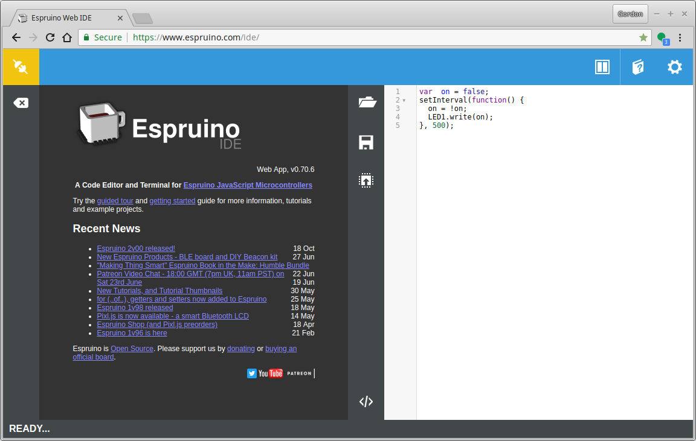
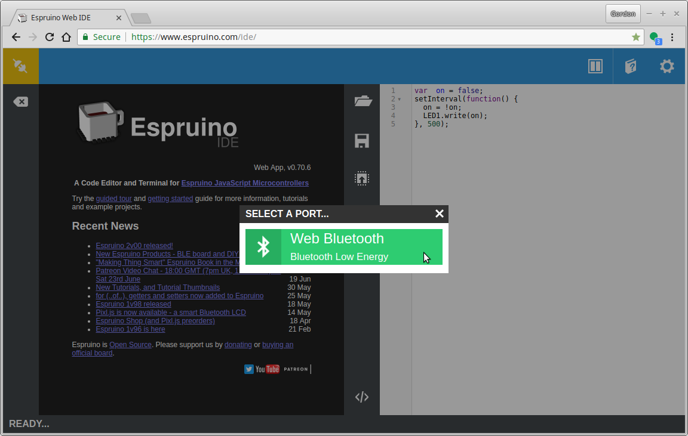
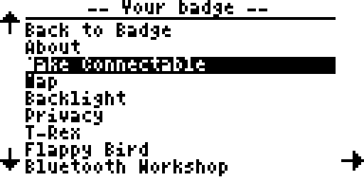
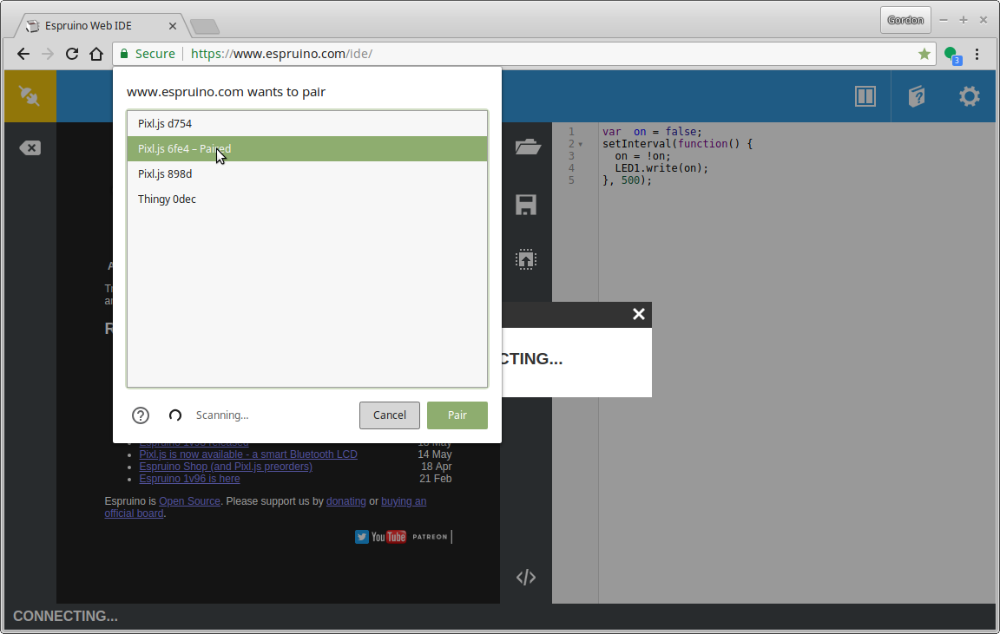
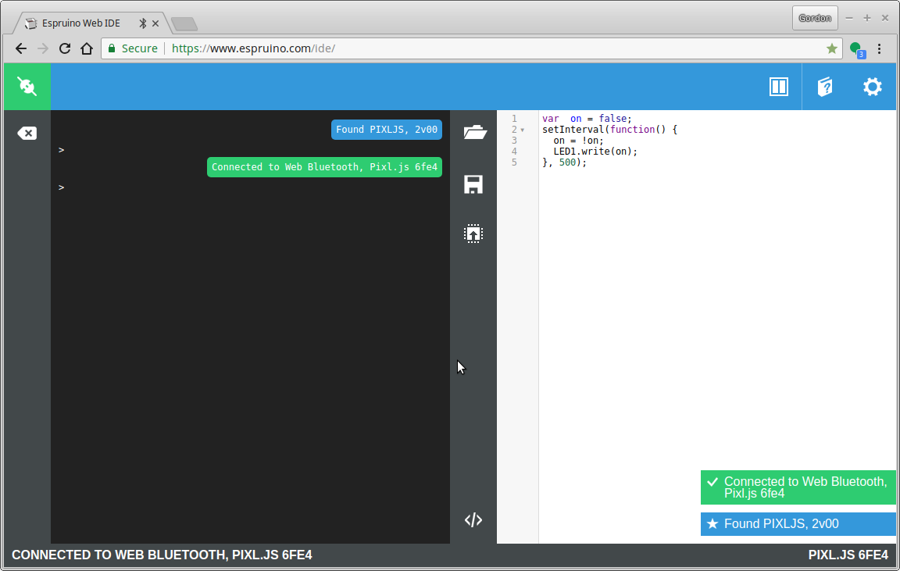

# Bluetooth Workshop

In this workshop we'll figure out how to use Web Bluetooth to interact with
other devices - but also how to use Espruino on embedded devices to develop
our own Bluetooth-enabled hardware.

## Step 1 - Connecting

The first step is to make sure you can connect to your Badge via Web Bluetooth.
We'll do this with the Espruino IDE - once connected you'll be able to fully reprogram your badge if you want to.

* First, go to http://www.espruino.com/ide **in an up to date Chrome Web Browser**
* Click the connection icon in the top left

* You should see `Web Bluetooth` - if you don't, check out [Espruino's Guide](http://www.espruino.com/Quick+Start+BLE#with-web-bluetooth) and if there's nothing useful there, seek help. We have a few USB dongles that'll work on older Macs and PCs.

* Now it's time to set up the badge so you can connect to it. Press a button
on the left-hand side to bring up the menu.
* Choose `Make Connectable`

* Now you should see the following screen - note the Name shown on-screen.

* Click the connect icon in the top left of the IDE again, and click `Web Bluetooth`
* You should see a bunch of devices - choose the one with the name as it is written on your badge's screen:

* Now you should be connected!

* On the left-hand side of the IDE is a REPL where you can enter commands. There's
Tab Completion which may help you.
* On the right-hand side there's an editor. Ctrl-Space will autocomplete, including documentation on the various functions available.
To upload code from the right-hand side, just click the 'Upload' button right in the middle of the IDE.

While waiting for everyone else, there are a few things you can do...

* Try the simple on-screen tutorial by clicking the book in the top right of the IDE,
followed by `Tutorial`
* See the written Espruino intro at http://www.espruino.com/Quick+Start+Code
* Check out [the Nodeconf EU Badge's documentation and examples](https://github.com/nearform/nceubadge2018)
* Play around with the [Graphics library](http://www.espruino.com/Reference#Graphics) - the badge comes with a built-in Graphics class called `g`. You just need to call `g.flip()` to update your changes to the LCD display.
* Try some of [Espruino's Pixl.js Tutorials/Code](http://www.espruino.com/Pixl.js#tutorials),
for example the [Morphing Clock](http://www.espruino.com/Morphing+Clock)

## Web Bluetooth Steps...

If the IDE at http://www.espruino.com/ide worked for you then great,
you're sorted!

If it didn't and it couldn't be made to work, but you can get Node.js and [Noble](https://github.com/noble/noble) working then
you can use [the Web Bluetooth wrapper for Node](https://www.npmjs.com/package/webbluetooth)
to follow along with more or less the same code (you can also use the
[Espruino command-line tools]((https://www.npmjs.com/package/espruino)) to communicate with your badge.

## [Step 2 - Advertising](step2.md)
