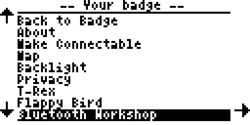
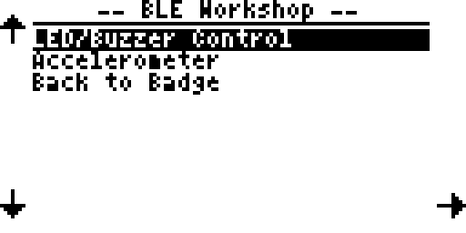

## Step 4 : Web Bluetooth - Writing

Ok, so we know what we're doing is working. Let's do some proper Web Bluetooth,
without the libraries.

First, let's set the badge up with some demo code that's pre-loaded on it,
which creates a service which allows you to control the RGB LED and Vibration
motor.

* Ensure you don't have the `nRF Connect` app or and Web Bluetooth pages open and connected to the badge
* Flip the switch on the back to power cycle your badge.
* Press a button on the left-hand side to get to the menu



* Choose `Blueooth Workshop`



* Choose `LED/Buzzer Control`


* You should now see a menu saying the badge is connectable.

So what just happened? The Badge has now configured itself as the following:

* **Service:** UUID 7b340000-105b-2b38-3a74-2932f884e90e - Badge Service
  * **Characteristic:** UUID 7b340001-105b-2b38-3a74-2932f884e90e - LEDs - 3 bytes (writable)
  * **Characteristic:** UUID 7b340002-105b-2b38-3a74-2932f884e90e - Vibraton motors - 2 bytes (writable)

If we write to one of the characteristics, things should happen!

So how do we do that?

* Change your HTML file on GitHub to the following:

```HTML
<html>
<body>
<button onclick="connect()">Connect to Web Bluetooth</button>
<script>
function connect() {
  var options =  {
    filters: [
      {namePrefix: 'Pixl.js'},
    ],
    optionalServices: [ "7b340000-105b-2b38-3a74-2932f884e90e" ]
  };
  var busy = false;
  var gatt, service;
  // Bring up the Web Bluetooth Device Chooser
  navigator.bluetooth.requestDevice(options).then(function(device) {
    console.log('Device: ' + JSON.stringify(device));
    return device.gatt.connect();
  }).then(function(g) {
   gatt = g;
   // Get our custom service
   return gatt.getPrimaryService("7b340000-105b-2b38-3a74-2932f884e90e");
  }).then(function(service) {
    // Get the RGB LED characteristic
    return service.getCharacteristic("7b340001-105b-2b38-3a74-2932f884e90e");
  }).then(function(characteristic) {
    // Make a random color
    var rgb = new Uint8Array([
	    Math.random()*255,
	    Math.random()*255,
	    Math.random()*255]);
    // Write it to the characteristic
    return characteristic.writeValue(rgb);
  }).then(function() {
    gatt.disconnect();
    console.log("All Done!");
  }).catch(function(error) {
    console.log("Something went wrong. " + error);
  });
}
</script>
</body>
</html>
```

* Reload it, and click the `Connect to Web Bluetooth` button
* Select your badge from the Web Bluetooth Screen
* And all being well, your screen should change colour! Each time you click
the button, it'll reconnect and change to a new colour.

So what just happened? A few things:

* `navigator.bluetooth.requestDevice` was used to pop up a window and grab your device
* `device.gatt.connect()` then initiated a connection
* `gatt.getPrimaryService("7b340000-105b-2b38-3a74-2932f884e90e")` found the service matching the UUID we gave it
* `service.getCharacteristic("7b340001-105b-2b38-3a74-2932f884e90e")` found the matching characteristic (for the LEDs this time) on the given service (there can be other matching characteristics on another service)
* We used `characteristic.writeValue(rgb)` to write a`Uint8Array` of data to the badge
* After all that, `gatt.disconnect()` disconnects

And `Promises` glued it all together so we didn't end up with lots of nested callbacks.

You could try modifying this to:

* Flash the LEDs different colors using repeated `characteristic.writeValue`
* Change the Vibration motors using a different service UUID and a two element array (each element is a 0..255 value for motor speed).

### More Features

You can add colour selectors and sliders for setting the motor speed if you
want to. Take a look at this example!

You do need to ensure that you don't try and perform two
Bluetooth LE operations on the same connection at once.

To simplify this I've used a `busy` flag, but ideally you'd
have a queue of some kind.

```HTML
<html>
<body>
<button onclick="connect()">Connect to Web Bluetooth</button>
<input type="color" id="color" value="#e66465" style="display:none"/>
<input type="range" id="vibrateleft" min="0" max="255" value="0" style="display:none"/>
<input type="range" id="vibrateright" min="0" max="255" value="0" style="display:none"/>
<script>
function connect() {
  var options =  {
    filters: [
      {namePrefix: 'Pixl.js'},
    ],
    optionalServices: [ "7b340000-105b-2b38-3a74-2932f884e90e" ]
  };
  var busy = false;
  var gatt, service;
  navigator.bluetooth.requestDevice(options).then(function(device) {
    console.log('Device: ' + JSON.stringify(device));
    return device.gatt.connect();
  }).then(function(g) {
   gatt = g;
   // Get our custom service
   return gatt.getPrimaryService("7b340000-105b-2b38-3a74-2932f884e90e");
  }).then(function(s) {
    service = s;
    // Get the RGB LED characteristic
    return service.getCharacteristic("7b340001-105b-2b38-3a74-2932f884e90e");
  }).then(function(characteristic) {
    var colorPicker = document.querySelector("#color");
    colorPicker.style.display = "block";
    colorPicker.addEventListener("input", function(event) {
      var col = event.target.value;  // #bbggrr
      var rgb = new Uint8Array([
      	parseInt(col.substr(5,2),16),
       	parseInt(col.substr(3,2),16),
      	parseInt(col.substr(1,2),16)]);
      if (busy) return;
      busy = true;
      characteristic.writeValue(rgb).then(function() {
        busy = false;
      });
    }, false);
    // Get the Vibration characteristic
    return service.getCharacteristic("7b340002-105b-2b38-3a74-2932f884e90e");
   }).then(function(characteristic) {
    var vibl = document.querySelector("#vibrateleft");
    var vibr = document.querySelector("#vibrateright");
    vibl.style.display = "block";
    vibr.style.display = "block";
    function vibChange(event) {
      console.log(vibl.value,vibr.value);
      if (busy) return;
      busy = true;
      var v = new Uint8Array([vibl.value,vibr.value]);
      characteristic.writeValue(v).then(function() {
        busy = false;
      });
    }
    vibl.addEventListener("input", vibChange, false);
    vibr.addEventListener("input", vibChange, false);
  }).then(function() {
    //gatt.disconnect();
    console.log("Done!");
  }).catch(function(error) {
    console.log("Something went wrong. " + error);
  });
}
</script>
</body>
</html>
```


### How do you do this on the Bluetooth Peripheral?

The code needed to handle this on the peripheral (which is being called when
you choose the menu item) is simply:

```JS
NRF.setServices({
 "7b340000-105b-2b38-3a74-2932f884e90e" : {
   "7b340001-105b-2b38-3a74-2932f884e90e" : {
     writable : true,
     value : [0,0,0],
     maxLen : 3,
     onWrite : function(evt) {
       var d = new Uint8Array(evt.data);
       var c = [0|d[0],0|d[1],0|d[2]];
       NC.backlight(c.concat(c,c,c));
       NC.ledTop(c);
       NC.ledBottom(c);
       Terminal.println("LED "+d);
     },
   },
   "7b340002-105b-2b38-3a74-2932f884e90e" : {
     writable : true,
     value : [0,0],
     maxLen : 2,
     onWrite : function(evt) {
       var d = new Uint8Array(evt.data);
       analogWrite(VIBL,(0|d[0])/255);
       analogWrite(VIBR,(0|d[1])/255);
       Terminal.println("BUZZ "+d);
     }
   }
 }
},{uart:false});
```


## [Step 5 - Notifications](step5.md)
